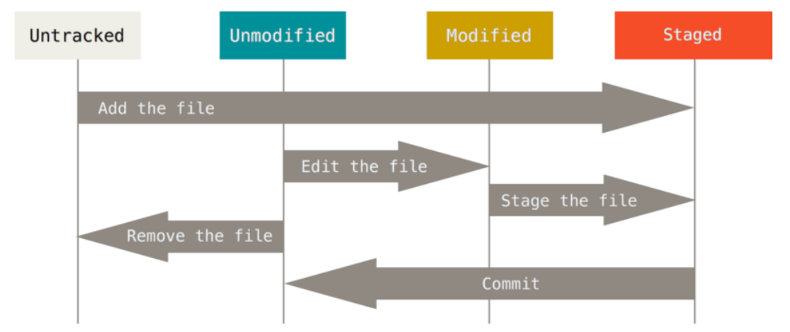

Git Basics
==
###### [Index](../index.md) / Git Basics / 2-2 Recording Changes to the Repository

## 2-2 Recording Changes to the Repository

At this point, you should have a bona fide Git repository on your local machine, and a checkout or working copy of all of its files in front of you. Typically, you’ll want to start making changes and committing snapshots of those  hanges into your repository each time the project reaches a state you want to record.

Remember that each file in your working directory can be in one of two states: tracked or untracked. Tracked files are files that were in the last snapshot; they can be unmodified, modified, or staged. In short, tracked files are files that Git knows about.

Untracked files are everything else — any files in your working directory that were not in your last snapshot and are not in your taging area. When you first clone a repository, all of your files will be tracked and unmodified because Git just checked them out and you haven’t edited anything.

As you edit files, Git sees them as modified, because you’ve changed them since your last commit. As you work, you selectively stage these modified files and then commit all those staged changes, and the cycle repeats.

[...Prev Page](2-1-2.md) <--------------> [Next Page...](2-2-1.md)