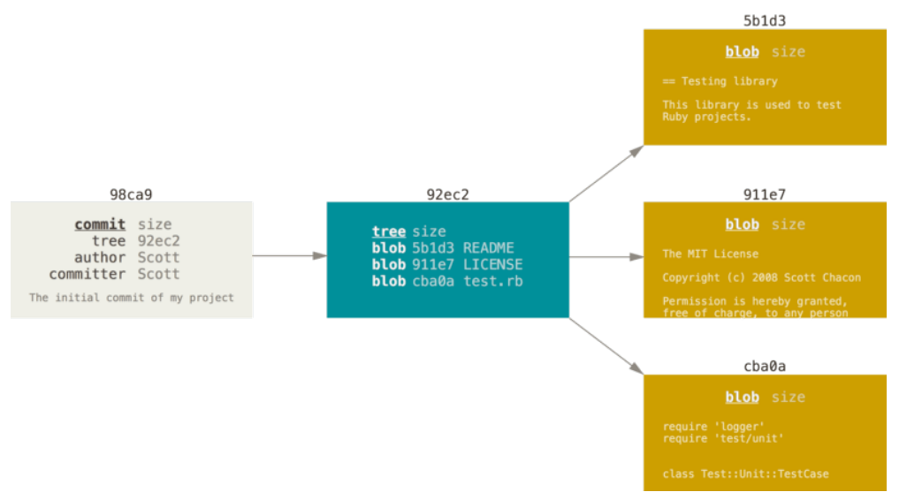
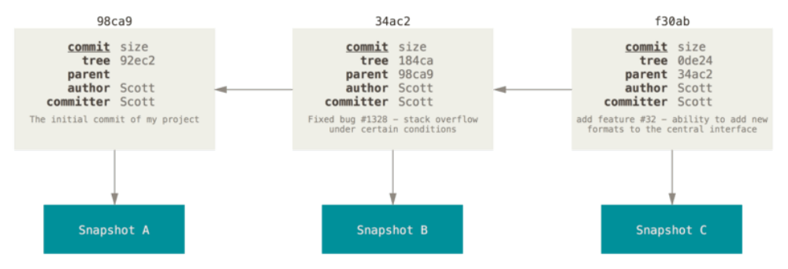
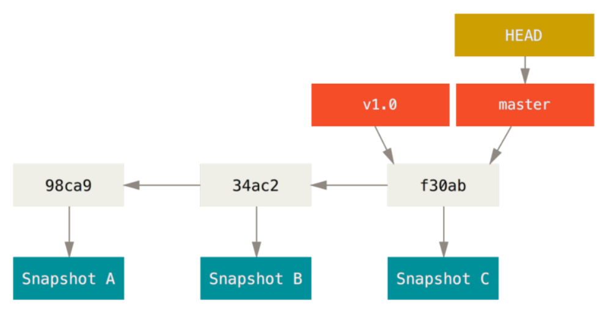

Git Branching
==
###### [Index](../index.md) / Git Branching / 3-1 Branches in a Nutshell

## 3-1 Branches in a Nutshell

To really understand the way Git does branching, we need to take a step back and examine how Git stores its data.

When you make a commit, Git stores a commit object that contains a pointer to the snapshot of the content you staged. This object also contains the author’s name and email address, the message that you typed, and pointers to the commit or commits that directly came before this commit (its parent or parents): zero parents for the initial commit, one parent for a normal commit, and multiple parents for a commit that results from a merge of two or more branches.

To visualize this, let’s assume that you have a directory containing three files, and you stage them all and commit. Staging the files computes a checksum for each one, stores that version of the file in the Git repository (Git refers to them as blobs), and adds that checksum to the staging area:

```
$ git add README test.rb LICENSE
$ git commit -m 'The initial commit of my project'
```

When you create the commit by running `git commit`, Git checksums each subdirectory (in this case, just the root project directory) and stores them as a tree object in the Git repository. Git then creates a commit object that has the metadata and a pointer to the root project tree so it can re-create that snapshot when needed.

Your Git repository now contains five objects: three blobs (each representing the contents of one of the three files), one tree that lists the contents of the directory and specifies which file names are stored as which blobs, and one commit with the pointer to that root tree and all the commit metadata.



If you make some changes and commit again, the next commit stores a pointer to the commit that came immediately before it.



A branch in Git is simply a lightweight movable pointer to one of these commits. The default branch name in Git is `master`. As you start making commits, you’re given a `master` branch that points to the last commit you made. Every time you commit, the `master` branch pointer moves forward
automatically.

>The “master” branch in Git is not a special branch. It is exactly like any other branch. The only reason nearly every repository has one is that the git init command creates it by default and most people don’t bother to change it.




[...Prev Page](2-5-4.md) <--------------> [Next Page...](3-2-0.md)