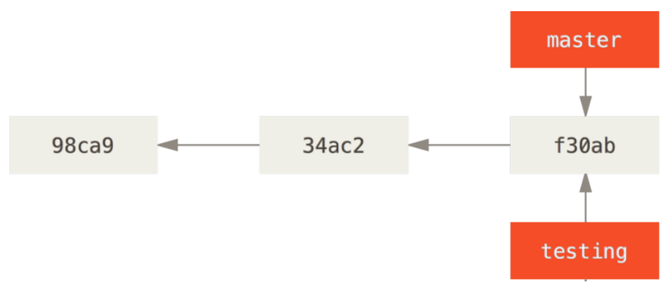
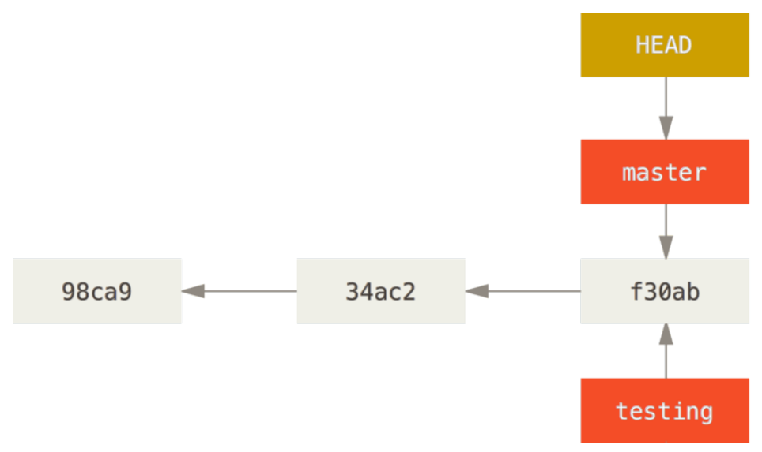

Git Branching
==
###### [Index](../index.md) / Git Branching / 3-2 Creating a New Branch

## 3-2 Creating a New Branch

What happens when you create a new branch? Well, doing so creates a new pointer for you to move around. Let’s say you want to create a new branch called `testing`. You do this with the `git branch` command:

```
$ git branch testing
```

This creates a new pointer to the same commit you’re currently on.



How does Git know what branch you’re currently on? It keeps a special pointer called `HEAD`. Note that this is a lot different than the concept of `HEAD` in other VCSs you may be used to, such as Subversion or CVS. In Git, this is a pointer to the local branch you’re currently on. In this case, you’re still on `master`. The `git branch` command only created a new branch — it didn’t switch to that branch.



You can easily see this by running a simple `git log` command that shows you where the branch pointers are pointing. This option is called `--decorate`.

```
$ git log --oneline --decorate
f30ab (HEAD -> master, testing) add feature #32 - ability to add new formats to the
central interface
34ac2 Fixed bug #1328 - stack overflow under certain conditions
98ca9 The initial commit of my project
```

You can see the “master” and “testing” branches that are right there next to the `f30ab` commit.


[...Prev Page](3-1-0.md) <--------------> [Next Page...](3-3-0.md)