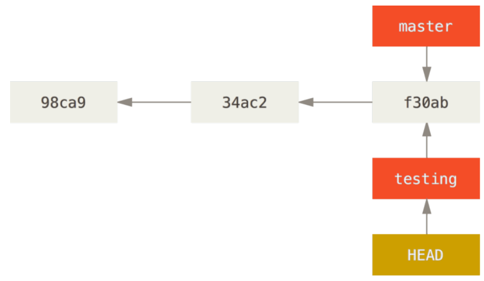
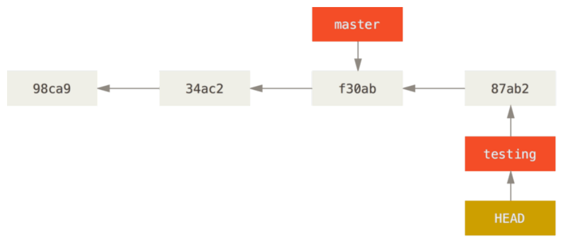
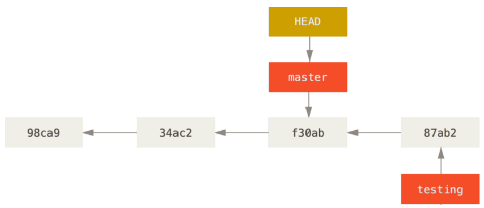
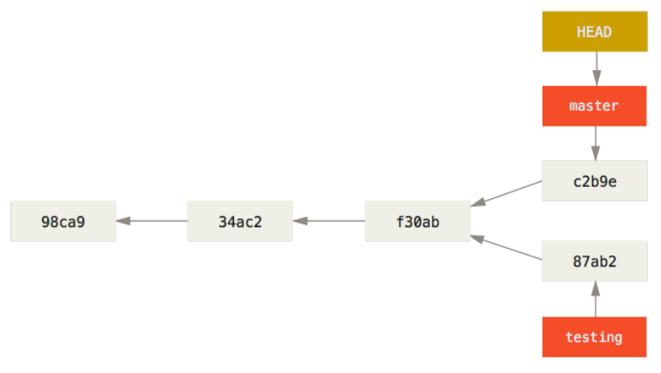

Git Branching
==
###### [Index](../index.md) / Git Branching / 3-3 Switching Branches

## 3-3 Switching Branches

To switch to an existing branch, you run the `git checkout` command. Let’s switch to the new testing branch:

```
$ git checkout testing
```

This moves `HEAD` to point to the `testing` branch.



What is the significance of that? Well, let’s do another commit:

```
$ vim test.rb
$ git commit -a -m 'made a change'
```



This is interesting, because now your `testing` branch has moved forward, but your `master` branch still points to the commit you were on when you ran `git checkout` to switch branches. Let’s switch back to the `master` branch:
```
$ git checkout master
```



That command did two things. It moved the HEAD pointer back to point to the `master` branch, and it reverted the files in your working directory back to the snapshot that `master` points to. This also means the changes you make from this point forward will diverge from an older version of the project. It essentially rewinds the work you’ve done in your `testing` branch so you can go in a different direction.

Let’s make a few changes and commit again:

```
$ vim test.rb
$ git commit -a -m 'made other changes'
```

Now your project history has diverged. You created and switched to a branch, did some work on it, and then switched back to your main branch and did other work. Both of those changes are isolated in separate branches: you can switch back and forth between the branches and merge them together when you’re ready. And you did all that with simple `branch`, `checkout`, and `commit` commands.



You can also see this easily with the `git log` command. If you run `git log --oneline --decorate --graph --all` it will print out the history of your commits, showing where your branch pointers are and how your history has diverged.

```
$ git log --oneline --decorate --graph --all
* c2b9e (HEAD, master) made other changes
| * 87ab2 (testing) made a change
|/
* f30ab add feature #32 - ability to add new formats to the
* 34ac2 fixed bug #1328 - stack overflow under certain conditions
* 98ca9 initial commit of my project
```

Because a branch in Git is actually a simple file that contains the 40 character SHA-1 checksum of the commit it points to, branches are cheap to create and destroy. Creating a new branch is as quick and simple as writing 41 bytes to a file (40 characters and a newline).


[...Prev Page](3-2-0.md) <--------------> [Next Page...](3-4-0.md)