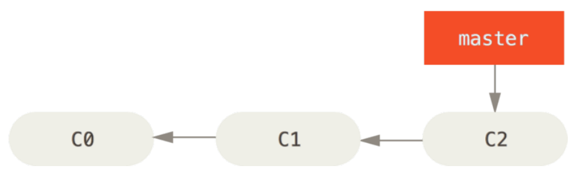
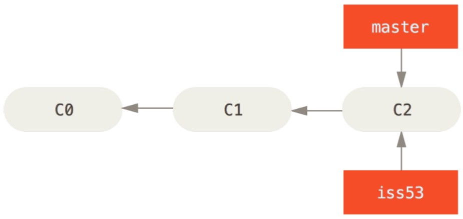
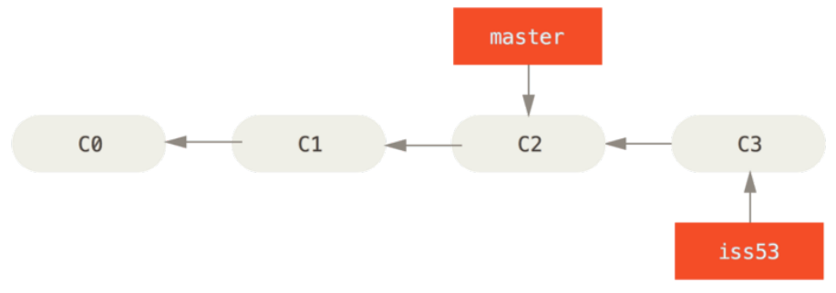
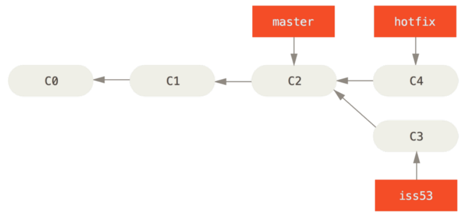
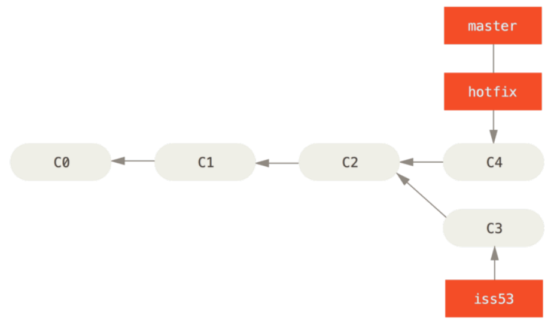
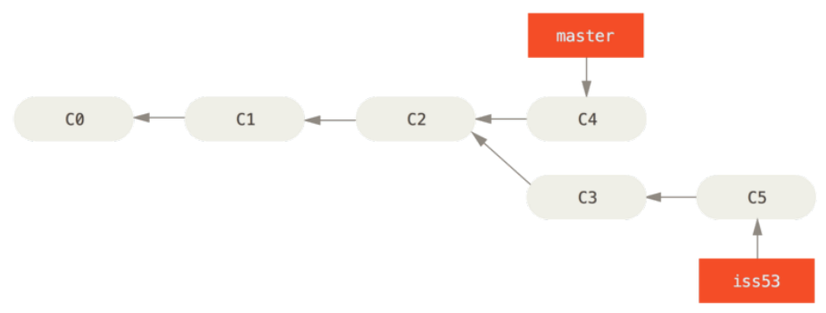

Git Branching
==
###### [Index](../index.md) / Git Branching / [3-4 Basic Branching and Merging](3-4-0.md) / 3-4-1 Basic Branching

### 3-4-1 Basic Branching

First, let’s say you’re working on your project and have a couple of commits already on the `master` branch.



You’ve decided that you’re going to work on issue #53 in whatever issue-tracking system your company uses. To create a new branch and switch to it at the same time, you can run the `git checkout` command with the `-b` switch:

```
$ git checkout -b iss53
Switched to a new branch "iss53"
```

This is shorthand for:

```
$ git branch iss53
$ git checkout iss53
```



You work on your website and do some commits. Doing so moves the `iss53` branch forward, because you have it checked out (that is, your `HEAD` is pointing to it):

```
$ vim index.html
$ git commit -a -m 'added a new footer [issue 53]'
```



Now you get the call that there is an issue with the website, and you need to fix it immediately. With Git, you don’t have to deploy your fix along with the `iss53` changes you’ve made, and you don’t have to put a lot of effort into reverting those changes before you can work on applying your fix to what is in production. All you have to do is switch back to your `master` branch.

However, before you do that, note that if your working directory or staging area has uncommitted changes that conflict with the branch you’re checking out, Git won’t let you switch branches. It’s best to have a clean working state when you switch branches. There are ways to get around this (namely, stashing and commit amending) that we’ll cover later on, in Stashing and Cleaning. For now, let’s assume you’ve committed all your changes, so you can switch back to your `master` branch:

```
$ git checkout master
Switched to branch 'master'
```

At this point, your project working directory is exactly the way it was before you started working on issue #53, and you can concentrate on your hotfix. This is an important point to remember: when you switch branches, Git resets your working directory to look like it did the last time you committed on that branch. It adds, removes, and modifies files automatically to make sure your working copy is what the branch looked like on your last commit to it.

Next, you have a hotfix to make. Let’s create a hotfix branch on which to work until it’s completed:

```
$ git checkout -b hotfix
Switched to a new branch 'hotfix'
$ vim index.html
$ git commit -a -m 'fixed the broken email address'
[hotfix 1fb7853] fixed the broken email address
 1 file changed, 2 insertions(+)
```



You can run your tests, make sure the hotfix is what you want, and finally merge the `hotfix` branch back into your `master` branch to deploy to production. You do this with the command:

```
$ git checkout master
$ git merge hotfix
Updating f42c576..3a0874c
Fast-forward
 index.html | 2 ++
 1 file changed, 2 insertions(+)
```

You’ll notice the phrase “fast-forward” in that merge. Because the commit `C4` pointed to by the branch `hotfix` you merged in was directly ahead of the commit `C2` you’re on, Git simply moves the pointer forward. To phrase that another way, when you try to merge one commit with a commit that can be reached by following the first commit’s history, Git simplifies things by moving the pointer forward because there is no divergent work to merge together — this is called a “fast- forward.”

Your change is now in the snapshot of the commit pointed to by the `master` branch, and you can deploy the fix.




After your super-important fix is deployed, you’re ready to switch back to the work you were doing before you were interrupted. However, first you’ll delete the `hotfix` branch, because you no longer need it — the `master` branch points at the same place. You can delete it with the `-d` option to `git branch`:

```
$ git branch -d hotfix
Deleted branch hotfix (3a0874c).
```

Now you can switch back to your work-in-progress branch on issue #53 and continue working on it.

```
$ git checkout iss53
Switched to branch "iss53"
$ vim index.html
$ git commit -a -m 'finished the new footer [issue 53]'
[iss53 ad82d7a] finished the new footer [issue 53]
1 file changed, 1 insertion(+)
```



It’s worth noting here that the work you did in your `hotfix` branch is not contained in the files in your `iss53` branch. If you need to pull it in, you can merge your `master` branch into your `iss53` branch by running `git merge master`, or you can wait to integrate those changes until you decide to pull the `iss53` branch back into `master` later.

[...Prev Page](3-4-0.md) <--------------> [Next Page...](3-4-2.md)