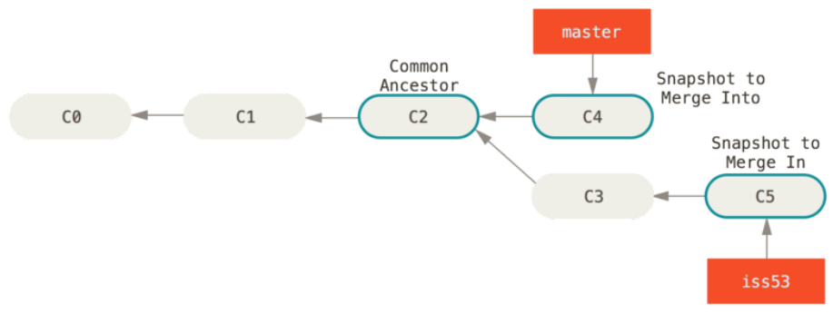
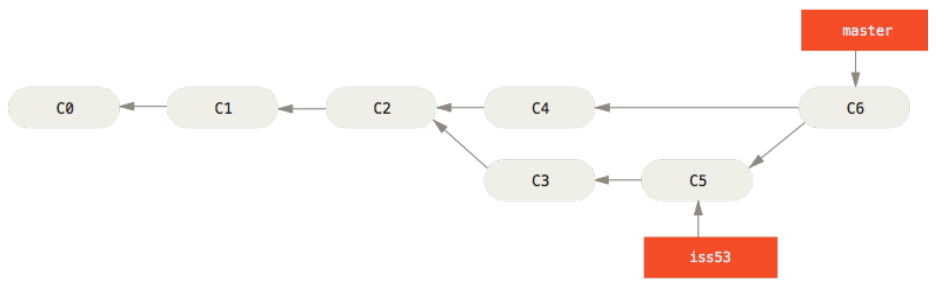

Git Branching
==
###### [Index](../index.md) / Git Branching / [3-4 Basic Branching and Merging](3-4-0.md) / 3-4-2 Basic Merging

### 3-4-2 Basic Merging

Suppose you’ve decided that your issue #53 work is complete and ready to be merged into your `master` branch. In order to do that, you’ll merge your `iss53` branch into `master`, much like you merged your `hotfix` branch earlier. All you have to do is check out the branch you wish to merge into and then run the `git merge` command:

```
$ git checkout master
Switched to branch 'master'
$ git merge iss53
Merge made by the 'recursive' strategy.
index.html | 1 +
1 file changed, 1 insertion(+)
```

This looks a bit different than the `hotfix` merge you did earlier. In this case, your development history has diverged from some older point. Because the commit on the branch you’re on isn’t a direct ancestor of the branch you’re merging in, Git has to do some work. In this case, Git does a simple three-way merge, using the two snapshots pointed to by the branch tips and the common ancestor of the two.



Instead of just moving the branch pointer forward, Git creates a new snapshot that results from this three-way merge and automatically creates a new commit that points to it. This is referred to as a merge commit, and is special in that it has more than one parent.



Now that your work is merged in, you have no further need for the iss53 branch. You can close the ticket in your ticket-tracking system, and delete the branch:

```
$ git branch -d iss53
```

[...Prev Page](3-4-1.md)